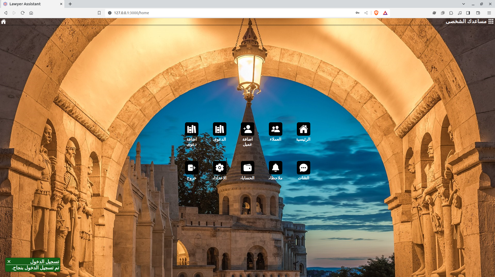
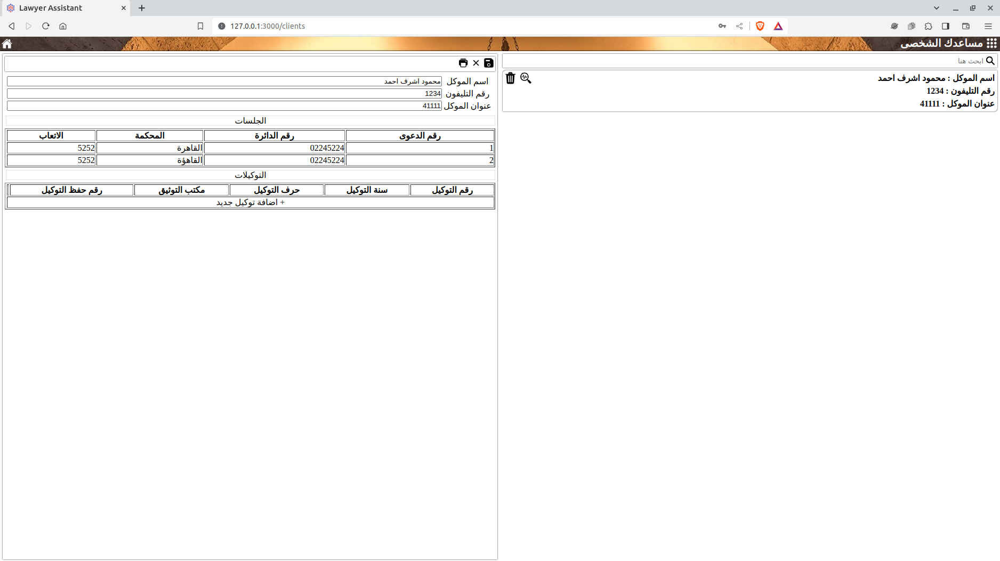
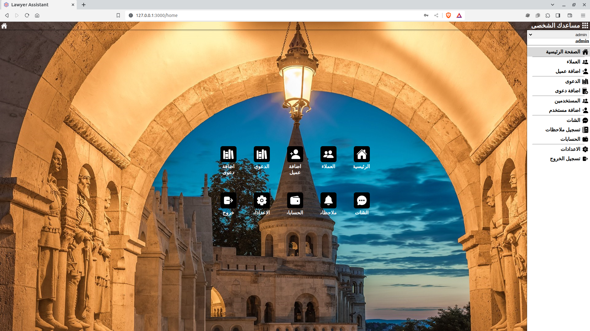

# Lawyer Assistant Old 🌺🌸💮𝕧ê𝔯ѕᎥʘη💮🌸🌺

This is a web app built using Angular and Express.js to help lawyers with their work.

## Screenshots




---

## Features

- Case management
- Client management
- Document management
- Task management
- Notes
- smothing Animation
- chat


## Requirements
- Node.js v16 or higher
- Angular CLI

## Installation
-  Clone this repository:

```bash
  git clone https://github.com/mahmoudashraf-code/lawerAssistant-old.git
  cd lawerAssistant-old
```
- Install front dependencies:

```bash
  npm i
```

- Install server dependencies:

```bash
  cd output
  npm i
```


## Usage
-  Start the server:
```bash
  cd output
  npm run start
```


- Open a web browser and go to http://localhost:3000


## Security
This app does not store any of your personal information. All communication between the client and server is encrypted over HTTPS.


## Troubleshooting
If you are having any problems with this app, please open an issue on GitHub.


## License
This app is licensed under the [MIT](https://choosealicense.com/licenses/mit/) License.


